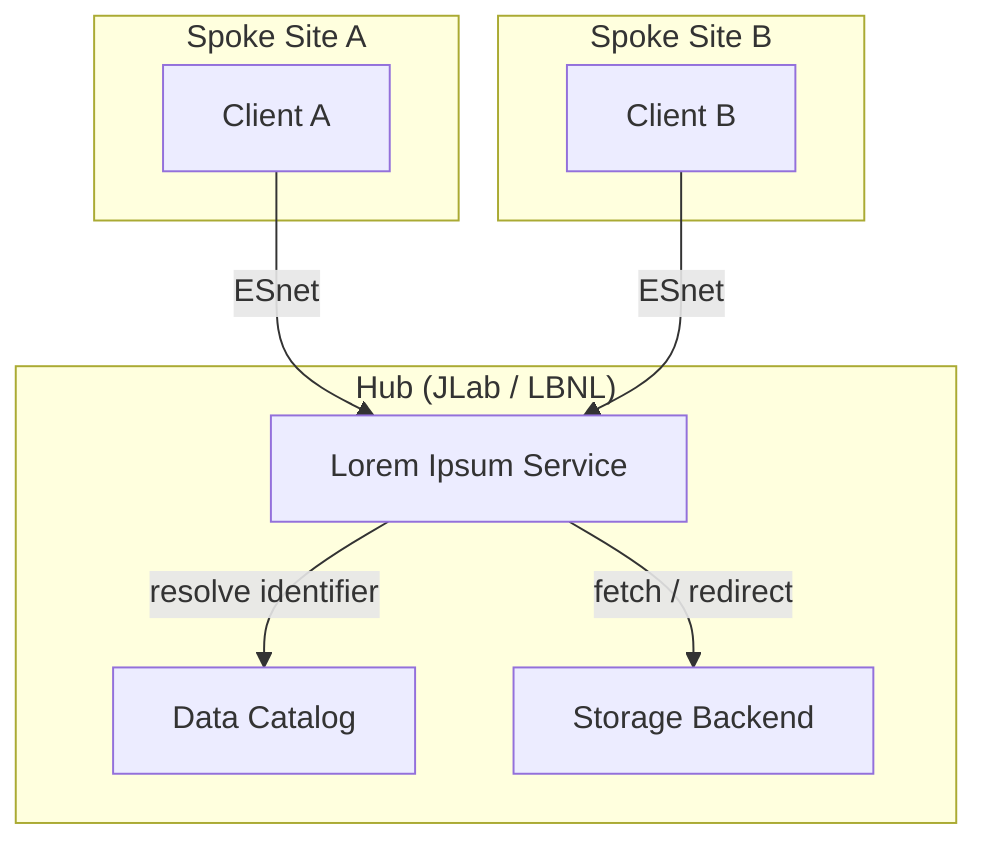
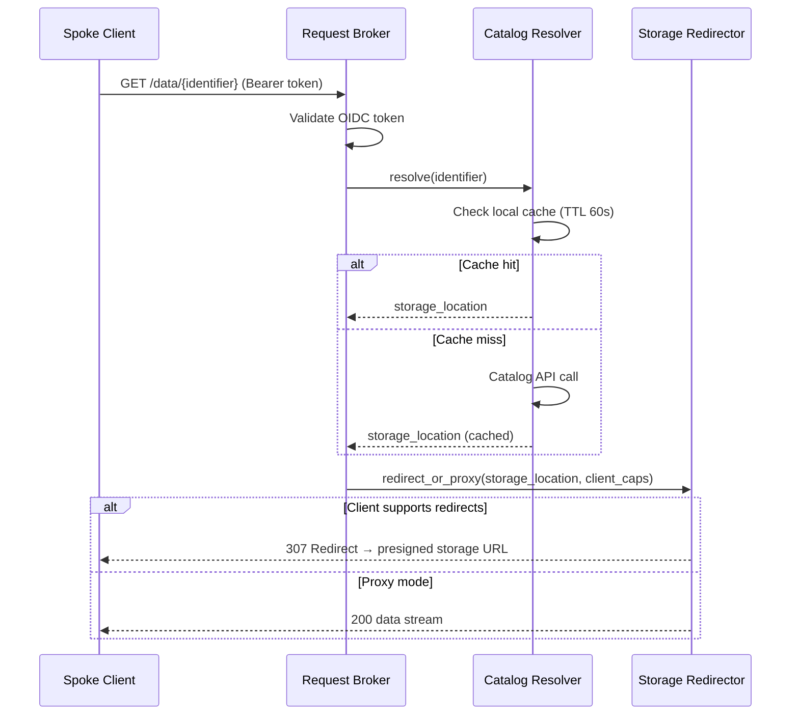
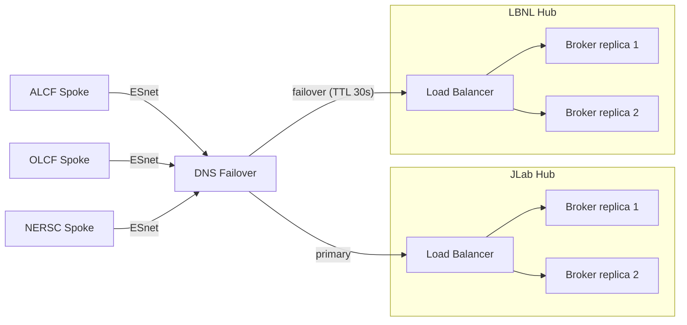
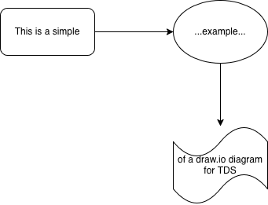

---
# ─── Document Identity ────────────────────────────────────────────────────────
doc_id: "HPDF_TDS_0001"
title: "Example Component: Lorem Ipsum Service"
version: "0.1"
status: "DRAFT"                    # DRAFT | REVIEW | APPROVED | SUPERSEDED | DEPRECATED
owner: "I. Baldin"                  # Single engineer responsible for this
contributors:                      # List of contributors
  - "J. Smith"
  - "A. Doe"
created: "2026-05-21"
last_updated: "2026-05-27"

# ─── Pandoc rendering hints ───────────────────────────────────────────────────
# Render to DOCX (use scripts/tds_render.py — it handles Mermaid pre-rendering):
#   python3 scripts/tds_render.py HPDF_TDS_0001_example.md [--reference-doc hpdf-reference.docx]
# Section numbering is controlled by the numbersections field below.
# See TDS_WORKFLOW.md §6 for full rendering instructions.
toc: true
numbersections: false   # set to true to add pandoc section numbers to the DOCX
---

# HPDF_TDS_0001 — Example Component: Lorem Ipsum Service

| Field | Value |
|---|---|
| **Document ID** | HPDF_TDS_0001 |
| **Title** | Example Component: Lorem Ipsum Service |
| **Version** | 0.1 |
| **Status** | DRAFT |
| **Owner** | I. Baldin |
| **Created** | 2026-05-21 |
| **Last Updated** | 2026-05-27 |

---

## 1. Overview & Objectives [REQUIRED]

Lorem ipsum dolor sit amet, consectetur adipiscing elit. The Lorem Ipsum Service is an HPDF Hub component responsible for brokering lorem requests between Spoke sites and the central data repository. It exists within HPDF to ensure that scientific users across all Spoke deployments can access ipsum-formatted data artifacts in a findable, accessible, and interoperable manner consistent with FAIR principles.

The core design decision this TDS records is the choice to implement the service as a stateless broker rather than a stateful cache, enabling independent horizontal scaling at both Hub sites (JLab and LBNL) while delegating persistent state to the underlying storage tier. This document covers the initial Hub-side deployment; Spoke-side deployment is addressed in HPDF_TDS_0002.

---

## 2. Background and Motivation [REQUIRED]

### 2.1 Context

Sed ut perspiciatis unde omnis iste natus error sit voluptatem accusantium doloremque laudantium. HPDF's mission requires delivering state-of-the-art data management infrastructure across a geographically distributed hub-and-spoke topology. As part of DOE's Integrated Research Infrastructure initiative, the facility must support seamless data and compute integration between the Hub (JLab / LBNL) and connected Spoke sites via ESnet.

The Lorem Ipsum Service addresses the data discovery and access stage of the HPDF data lifecycle. Scientific users at Spoke sites require low-latency access to ipsum-formatted artifacts catalogued at the Hub without requiring direct knowledge of the Hub's internal storage layout.

### 2.2 Problem Statement

Nemo enim ipsam voluptatem quia voluptas sit aspernatur aut odit aut fugit. Currently, Spoke-side clients must maintain bespoke mappings to Hub storage endpoints, leading to tight coupling between client configurations and Hub topology changes. When the Hub storage layout is reorganized — as anticipated during the JLab Data Center (JLDC) expansion through 2029 — all Spoke-side configurations must be updated in lockstep.

The problem is the absence of a stable, topology-independent addressing layer between clients and Hub storage. This TDS designs the Lorem Ipsum Service as that layer.

### 2.3 Prior Work and Related Systems

| System / Component | Relationship | Notes |
|---|---|---|
| Globus Transfer | Interoperates | Used for bulk data movement between Hub and Spoke endpoints; the Lorem Ipsum Service provides the addressing layer above Globus |
| HPDF Data Catalog | Depends on | Catalog provides the authoritative namespace; this service resolves catalog identifiers to storage locations |
| ESnet | Infrastructure dependency | All Hub–Spoke traffic transits ESnet; latency budget assumes ≤ 20ms Hub-to-Spoke RTT |
| NERSC HPSS | Related system | Similar broker pattern used at NERSC; design reviewed for lessons learned |

---

## 3. Architecture and Design [REQUIRED]

### 3.1 Overview

<!-- Using Mermaid (Option B). tds render auto-renders this block to PNG and saves
     the source as diagrams/mmdc-example-01.mmd. tds unrender restores it. -->

At rest, lorem ipsum dolor sit amet components reside at the Hub and expose a single stable API endpoint. Spoke-side clients interact exclusively with this endpoint; Hub-internal storage topology is hidden. The service resolves incoming requests against the Data Catalog, selects the appropriate storage backend, and streams or redirects data to the client.



The sequence diagram below shows the internal request flow through the three broker components for a successful data retrieval:



### 3.2 Component Discussion

#### 3.2.1 Request Broker

Ut enim ad minima veniam, quis nostrum exercitationem ullam corporis suscipit laboriosam. The Request Broker is the entry point for all client requests. It runs at the Hub (both JLab and LBNL instances) and is stateless — no session state is retained between requests. It is responsible for authenticating the caller (via OIDC bearer token), extracting the requested identifier, and dispatching the resolution query to the Catalog Resolver.

The broker is horizontally scalable; additional instances can be added behind the Hub load balancer without coordination. It runs as a containerized service.

#### 3.2.2 Catalog Resolver

Quis autem vel eum iure reprehenderit qui in ea voluptate velit esse quam nihil molestiae consequatur. The Catalog Resolver translates a stable HPDF data identifier (as registered in the Data Catalog) into a physical storage location. It caches resolution results in a short-lived local cache (TTL: 60 seconds) to reduce Catalog load under high request rates. Cache misses result in a synchronous Catalog API call.

The Resolver runs co-located with the Request Broker and shares its container image. Catalog API credentials are injected via the Hub secrets manager.

#### 3.2.3 Storage Redirector

Neque porro quisquam est, qui dolorem ipsum quia dolor sit amet. Once a physical location is resolved, the Storage Redirector either issues an HTTP 307 redirect (for clients capable of following redirects to the storage endpoint directly) or proxies the data stream (for clients behind restrictive firewalls that cannot reach Hub storage directly). The choice of redirect vs. proxy is signalled by the client via a request header.

---

## 4. Security Considerations [OPTIONAL]

### 4.1 Threat Model

<!-- Using ASCII art (Option A) to illustrate the trust boundary — simple enough
     for a ```text fenced block; no external tooling required. -->

The primary trust boundary lies between the public ESnet-facing API and the Hub-internal network:

```text
[ Spoke Client ] ──(ESnet, TLS 1.3)──► [ LIS API Gateway ] ──(internal)──► [ Catalog / Storage ]
       │                                        │
  untrusted zone                         trust boundary
  (authentication required)              (mTLS between internal components)
```

| Threat | Likelihood | Impact | Mitigation |
|---|---|---|---|
| Unauthorized data access via forged token | Medium | High | OIDC token validation at API gateway; short token TTL enforced |
| Catalog poisoning via resolver cache | Low | High | Cache keyed on validated identifier only; TTL limits blast radius |
| Storage location enumeration | Medium | Medium | Storage URLs are pre-signed with short expiry; not stable or guessable |
| Denial of service via request flood | Medium | Medium | Rate limiting at API gateway per client identity |

### 4.2 Security Discussion

At vero eos et accusamus et iusto odio dignissimos ducimus qui blanditiis praesentium voluptatum deleniti atque corrupti. All Hub–Spoke communication is encrypted with TLS 1.3. Internal Hub component communication uses mutual TLS. Caller identity is established via OIDC bearer tokens issued by the HPDF identity provider; the service does not accept opaque tokens and requires `at+jwt` format per RFC 9068.

Authorization is attribute-based: the Data Catalog record for each artifact carries an access policy that the Catalog Resolver evaluates against the caller's token claims. No central PDP is consulted at request time; policy is inline at the Resolver.

---

## 5. Operational Considerations [OPTIONAL]

### 5.1 Deployment Model

Lorem ipsum dolor sit amet, consectetur adipiscing elit. The Lorem Ipsum Service is deployed as a containerized workload at both Hub sites (JLab and LBNL) for geographic resilience. Each site runs at least two Request Broker replicas behind a site-local load balancer. The two Hub sites operate independently; there is no active cross-site state synchronization.

Spoke sites do not run any component of this service; they interact solely via the Hub API endpoint.

The deployment topology across Hub sites and connected Spokes is shown below:



### 5.2 Configuration Management

Sed do eiusmod tempor incididunt ut labore et dolore magna aliqua. Service configuration is delivered via environment variables injected at container start. Secrets (Catalog API credentials, mTLS certificates) are managed by the Hub secrets manager and rotated on a 90-day cycle. Site-specific endpoint addresses (e.g., JLab vs. LBNL storage backend URLs) are provided via a site configuration file mounted into the container at deployment time.

### 5.3 Monitoring and Observability

| Signal type | What is measured | Alerting threshold |
|---|---|---|
| Metric | Request rate (req/s) | > 10,000 req/s sustained for 5 min |
| Metric | p99 request latency | > 500ms |
| Metric | Catalog resolver cache hit rate | < 70% |
| Log | Authentication failures | > 100 failures/min from a single client |
| Trace | End-to-end request span (broker → resolver → redirector) | Spans > 2s flagged for review |

### 5.4 Resilience and Failover

Ut enim ad minima veniam, quis nostrum exercitationem ullam corporis suscipit laboriosam. If the JLab Hub instance becomes unavailable, Spoke clients are redirected to the LBNL Hub instance via DNS failover (TTL: 30 seconds). The LBNL instance maintains its own Catalog Resolver cache and operates independently. In-flight requests to the failed instance are not retried automatically; clients are expected to implement exponential backoff.

If the Data Catalog itself is unavailable, the Resolver serves from cache for up to 60 seconds before returning a 503. Stale-while-revalidate is not implemented in this version.

### 5.5 Scalability

Quis autem vel eum iure reprehenderit qui in ea voluptate velit esse. The primary scaling axes are request volume (driven by connected Spoke client count) and artifact catalog size (driven by ingestion rate). The stateless broker scales horizontally without coordination. The Catalog Resolver cache is local per instance; cache warming after a new instance starts takes approximately 30 seconds under typical load. Known bottleneck: a single Catalog API instance serves all Resolver instances; Catalog scaling is outside the scope of this TDS and addressed in HPDF_TDS_0002.

---

## 6. UX Considerations [OPTIONAL]

The Lorem Ipsum Service surfaces three distinct interfaces, each targeting a different user population within the HPDF community.

**Scientific end-users** (Spoke sites) interact exclusively with the stable REST API endpoint. Their primary workflow is submitting a `GET /data/{identifier}` request and receiving either a redirect to a presigned storage URL or a proxied data stream. The interface is intentionally narrow — one endpoint, one verb — to minimise the learning curve for scientists who are not expected to understand Hub topology. Error responses follow RFC 9457 (Problem Details for HTTP APIs), ensuring that `status`, `title`, `detail`, and a trace-id are always present, making errors self-explanatory and directly actionable without reference to Hub internals.

**Spoke site administrators** interact with the service through deployment configuration files and monitoring dashboards. Configuration is expressed in environment variables with human-readable names and inline documentation; a `--check-config` dry-run flag validates all required variables before container start. The Hub exposes a `/health` and `/metrics` endpoint for integration with site-local monitoring stacks (Prometheus-compatible). Alerting thresholds and their rationale are documented in §5.3; operators should not need to read source code to understand what each metric means.

**Hub operators** (JLab / LBNL staff) manage certificate rotation, secrets lifecycle, and scaling. These tasks are performed via Hub-internal tooling and are not exposed through the service's own interface. Credential rotation is documented as a runbook in the Hub operations wiki; a link to that runbook should be kept current in the deployment README.

No web UI is provided by this component. All surfaces are CLI or API-driven; no WCAG accessibility assessment is required for this version.

---

## 7. Open Questions [OPTIONAL]

| # | Question | Owner | Target date | Notes |
|---|---|---|---|---|
| OQ-01 | Should the Storage Redirector support S3-compatible presigned URLs as the redirect target, or only internal HPDF storage URLs? | I. Baldin | 2026-06-01 | Depends on whether Spoke sites will access S3-backed storage directly |
| OQ-02 | What is the maximum acceptable p99 latency for the resolution path under peak load? | B. Jones | 2026-06-01 | Needed to size the Catalog Resolver cache TTL and instance count |

---

## 8. Decision Records [OPTIONAL]

### DR-01: Stateless broker over stateful cache

- **Status**: Accepted
- **Context**: Early prototypes used a stateful proxy that maintained persistent connections to storage backends. This simplified redirect logic but created a single point of failure and complicated horizontal scaling.
- **Decision**: The service is stateless. Each request independently resolves the identifier and either redirects or proxies. A short-lived local cache (TTL 60s) reduces Catalog load without introducing distributed state.
- **Alternatives**:
  1. *Stateful proxy with persistent backend connections* — rejected because it requires shared session state across replicas and complicates failover between JLab and LBNL Hub instances.
  2. *Client-side caching only* — rejected because it places the resolution logic on every client implementation, making topology changes require coordinated client updates (the exact problem this design solves).

### DR-02: Inline policy evaluation at Catalog Resolver

- **Status**: Accepted
- **Context**: Two options were considered for access control: a central Policy Decision Point (PDP) consulted at request time, or inline evaluation of policies embedded in the Catalog record.
- **Decision**: Policies are embedded in Catalog records and evaluated inline by the Resolver. No external PDP is consulted at request time.
- **Alternatives**:
  1. *Central PDP (e.g., OPA, XACML)* — rejected for this component because it introduces a synchronous dependency on an additional service in the critical request path, increasing latency and adding a failure mode. A central PDP may be introduced for more complex policy scenarios in a future TDS.

---

## 9. Related Documents [REQUIRED]

| Doc ID | Title | Relationship |
|---|---|---|
| HPDF_TDS_0002 | Data Catalog API | Depends on — this service resolves identifiers via the Catalog API |
| TDS_TEMPLATE.md | TDS Template | Template used to produce this document |
| TDS_WORKFLOW.md | TDS Workflow Guide | Workflow and tooling reference |

---

## 10. Testing and Acceptance Criteria [OPTIONAL]

<!-- This section illustrates an engineer-authored PNG diagram (Option C).
     The source diagram was created in draw.io and exported as PNG.
     The .drawio source file should be committed alongside the PNG. -->

Lorem ipsum dolor sit amet, consectetur adipiscing elit. Validation will proceed in three phases: unit testing of the Catalog Resolver cache logic, integration testing of the full request path against a staging Catalog instance, and load testing to verify the p99 latency target under simulated peak load.

The diagram below illustrates the test environment topology:



| Requirement ID | Test approach | Acceptance criterion | Owner |
|---|---|---|---|
| Stateless broker (DR-01) | Deploy two replicas; kill one mid-request-stream | Zero in-flight requests fail on remaining replica | I. Baldin |
| p99 latency (OQ-02, TBD) | Load test at 5,000 req/s sustained for 10 min | p99 < TBD ms (pending OQ-02 resolution) | B. Jones |
| Auth rejection | Submit requests with expired and malformed tokens | 401 returned; no data leaked | A. Doe |
| Cache hit rate (NFR) | Replay identical identifiers under load | Cache hit rate > 70% after 30s warm-up | I. Baldin |

---

## 11. Revision History

| Version | Date | Author | Status | Summary of changes |
|---|---|---|---|---|
| 0.1 | 2026-05-21 | I. Baldin | DRAFT | Initial draft — lorem ipsum example document |
| 0.2 | 2026-05-27 | I. Baldin | DRAFT | Added §6 UX Considerations; renumbered §7–§11 |
