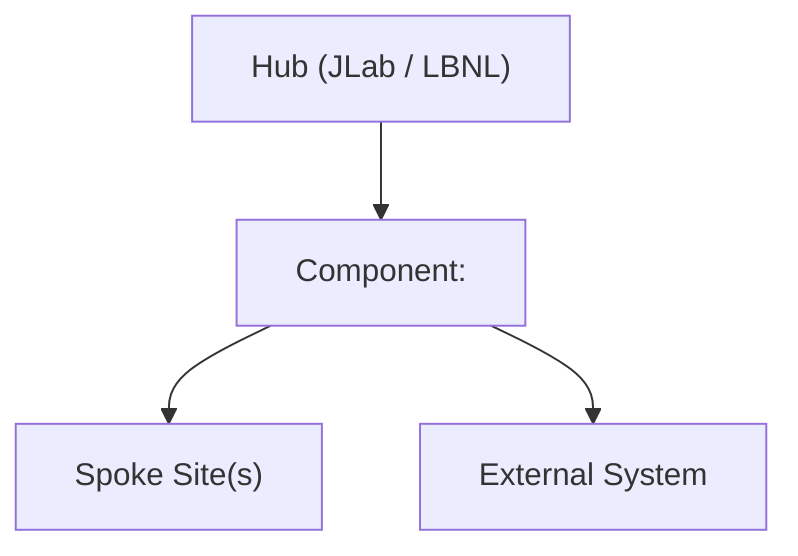

---
# ─── Document Identity ────────────────────────────────────────────────────────
doc_id: "HPDF_TDS_XXXX"           # Assigned from the TDS registry (see TDS_WORKFLOW.md)
title: "<Component or Feature Name>"
version: "0.1"
status: "DRAFT"                    # DRAFT | REVIEW | APPROVED | SUPERSEDED | DEPRECATED
owner: "<Name>"                    # Single engineer responsible for this
contributors: []                   # List of contributors                   
created: "YYYY-MM-DD"
last_updated: "YYYY-MM-DD"

# ─── Pandoc rendering hints ───────────────────────────────────────────────────
# Render to DOCX (use the tds wrapper — handles Mermaid, cover page, and pandoc):
#   tds render HPDF_TDS_XXXX_<slug>.md
# Convert reviewed DOCX back to Markdown:
#   tds unrender HPDF_TDS_XXXX_<slug>.docx
# Section numbering is controlled by the numbersections field below.
# See TDS_WORKFLOW.md §6 for full rendering instructions.
toc: true
numbersections: false   # set to true to add pandoc section numbers to the DOCX
---

<!-- ═══════════════════════════════════════════════════════════════════════════
     INSTRUCTIONS FOR AUTHORS AND LLM AGENTS
     ───────────────────────────────────────────────────────────────────────────
     • Fill in the YAML frontmatter above first — it drives document tracking.
     • Sections marked [REQUIRED] must have material present before status → REVIEW.
     • Sections marked [OPTIONAL] may be omitted only if genuinely not applicable.
     • Move resolved open questions from §7 to Decision Records (§8).
     • §7 Open Questions must be empty before status → APPROVED.
     • Diagrams: three options are supported — see TDS_WORKFLOW.md §6.2 for full guidance.
       - Option A: ASCII art (```text fenced block) — simple flows only.
       - Option B: Mermaid (```mermaid block) — renders in GitHub/GitLab; tds render
         converts to PNG and saves .mmd sidecars in diagrams/ automatically.
       - Option C: Engineer-authored PNG — store in diagrams/HPDF_TDS_NNNN_name.png
         and reference with . Pandoc embeds natively.
     • Remove this instruction block before publishing the document.
     ═══════════════════════════════════════════════════════════════════════════ -->

# HPDF_TDS_XXXX — \<Title\>

| Field | Value |
|---|---|
| **Document ID** | HPDF_TDS_XXXX |
| **Title** | \<Title\> |
| **Version** | 0.1 |
| **Status** | DRAFT |
| **Owner** | \<Name \> |
| **Created** | YYYY-MM-DD |
| **Last Updated** | YYYY-MM-DD |

---

## 1. Overview & Objectives [REQUIRED]

<!-- 3–6 sentences. Describe what this component does or design facet relates to, 
     why it exists within HPDF, and the key design decision this TDS records. 
     Written for a senior engineer who has not read the background.
     
      -->

> _Placeholder: Summarize the component, its role in HPDF, and the core design approach._

---

## 2. Background and Motivation [REQUIRED]

### 2.1 Context

<!-- Describe the scientific or operational need this design addresses.
     Reference HPDF's mission (data lifecycle, hub-and-spoke model, IRI integration,
     FAIR data principles) as appropriate. -->

### 2.2 Problem Statement

<!-- State precisely what problem is being solved. Distinguish this from the solution. -->

### 2.3 Prior Work and Related Systems

<!-- Reference any existing HPDF components, DOE facility systems, or external systems
     (e.g., Globus, NERSC, ESnet, INDIGO IAM, SciTokens) that this design builds on,
     replaces, or must interoperate with. -->

| System / Component | Relationship | Notes |
|---|---|---|
| | | |

---

## 3. Architecture and Design [REQUIRED]

### 3.1 Overview

<!-- Narrative description of the overall design. Include a high-level diagram.
     Choose a diagram format based on complexity (see TDS_WORKFLOW.md §6.2):
       - Simple flow → Mermaid (edit below; pre-render to PNG before DOCX export)
       - Complex architecture → replace with: 
       - Quick inline sketch → ASCII art in a ```text fenced block
     If using Mermaid, keep the .mmd source file alongside this document. -->



### 3.2 Component Discussion

<!-- Break the design into logical sub-components or layers. For each, state:
     - What it does
     - Where it runs (Hub / Spoke / Edge)
     - What it owns (state, data, policy) -->

#### 3.2.1 \<Sub-component A\>

#### 3.2.2 \<Sub-component B\>

---

## 4. Security Considerations [OPTIONAL]

<!-- Address the following. Mark N/A with justification if truly not applicable. -->

### 4.1 Threat Model

<!-- Identify the principal threats relevant to this component:
     e.g., unauthorized data access, token forgery, replay attacks,
     data exfiltration, supply chain compromise. -->

| Threat | Likelihood | Impact | Mitigation |
|---|---|---|---|
| | | | |

### 4.2 Security Discussion

<!-- Discuss security implications consistent with the thread model. -->

---

## 5. Operational Considerations [OPTIONAL]

### 5.1 Deployment Model

<!-- How is this component deployed? Containerized / bare metal / HPC module?
     Hub only, Spoke only, or both? Any site-specific configuration required? -->

### 5.2 Configuration Management

<!-- What is configurable? How is configuration delivered (env vars, config files,
     secrets manager, Helm values)? Who controls configuration at Hub vs. Spoke? -->

### 5.3 Monitoring and Observability

<!-- Metrics exposed, alerting thresholds, dashboards, log aggregation. -->

| Signal type | What is measured | Alerting threshold |
|---|---|---|
| Metric | | |
| Log | | |
| Trace | | |

### 5.4 Resilience and Failover

<!-- How does the system behave when this component fails?
     What is the recovery procedure?
     Are Hub and Spoke independently resilient? -->

### 5.5 Scalability

<!-- What are the scaling axes (data volume, user count, site count)?
     What are the known bottlenecks? -->

---

## 6. UX Considerations [OPTIONAL]

<!-- Address usability and user-facing concerns for this component. Even
     infrastructure components have "users" — operators, Spoke site
     administrators, and scientific end-users each interact with different
     surfaces and have different mental models. Consider covering, as applicable:

     • Target users: who interacts with this component and in what roles?
       Distinguish between personas (e.g., Hub admin vs. Spoke admin vs. scientist).
     • User workflows: what tasks does each persona perform, and in what sequence?
       Highlight where errors are likely and how the system helps recovery.
     • Interface surfaces: Web UI, CLI, REST API, configuration files, dashboards,
       log output? For each surface, note the expected level of expertise.
     • Error messaging: are errors actionable, self-explanatory, and scoped to the
       likely cause? Avoid exposing internal identifiers in user-facing messages.
     • Accessibility: any web-facing surface must meet WCAG 2.1 AA. Note compliance
       status or open gaps here.
     • Discoverability: how do users learn this component exists, what it does, and
       how to use it? Reference relevant documentation or onboarding flows.
     • Operator ergonomics: installation experience, first-run behaviour, routine
       administrative tasks (e.g., credential rotation, log inspection, scaling).

     If the component has no direct user-facing surface (e.g., an internal Hub
     daemon), mark this section with a one-sentence justification and omit
     the sub-sections. -->
---

## 7. Open Questions [OPTIONAL]

<!-- Use this table to track unresolved questions. Each should have an owner
     and a target resolution date. Move resolved questions to §8 (as a DR)
     or inline into the relevant section, then remove the row here. -->

| # | Question | Owner | Target date | Notes |
|---|---|---|---|---|
| OQ-01 | | | | |

---

## 8. Decision Records [OPTIONAL]

<!-- Add one subsection per significant design decision — one where a reasonable
     engineer might have chosen differently. Resolved open questions from §6 land here. -->

### DR-01: \<Decision Title\>

- **Status**: Accepted
- **Context**: _Why did this decision need to be made?_
- **Decision**: _What was decided?_
- **Alternatives**: _What else was considered, and why was it rejected?_

---

## 9. Related Documents [REQUIRED]

| Doc ID | Title | Relationship |
|---|---|---|
| | | Depends on / Informs / Supersedes |

---

## 10. Testing and Acceptance Criteria [OPTIONAL]

<!-- How will the design be validated? Include integration testing approach,
     acceptance criteria mapped to requirements, and any performance benchmarks. -->

| Requirement ID | Test approach | Acceptance criterion | Owner |
|---|---|---|---|
| | | | |

---

## 11. Revision History

| Version | Date | Author | Status | Summary of changes |
|---|---|---|---|---|
| 0.1 | YYYY-MM-DD | \<Name\> | DRAFT | Initial draft |
